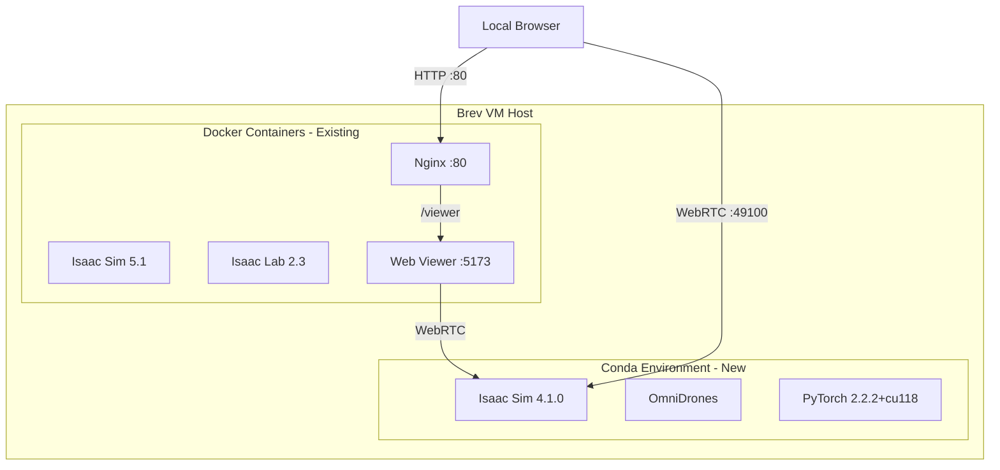

# OmniDrones VM Setup Plan (Pinned Versions)

## Pinned Versions

- Python 3.10
- PyTorch 2.2.2+cu118
- torchrl 0.3.1
- tensordict 0.3.2
- usd-core 23.11
- lxml 4.9.4

---

# OmniDrones Brev VM Setup Plan

## Current Environment Analysis

**Brev VM State:**

- GPU: NVIDIA A10G (24GB VRAM), Driver 580.126.09, CUDA 13.0
- Python: 3.10.12 (`python3`)
- Conda: Not installed (needs to be installed)
- Disk Space: 124GB free
- Docker containers running: `vscode`, `nginx`, `web-viewer` (Isaac Lab 2.3 + Isaac Sim 5.1)

**Existing Assets:**

- Isaac Sim 4.1.0 already extracted: `/home/ubuntu/OmniDrone/isaac-sim-4.1.0/`
- WebRTC streaming kit file: `apps/omni.isaac.sim.headless.webrtc.kit`
- WebRTC launcher: `isaac-sim.headless.webrtc.sh`

**Pre-installed Docker Setup (will NOT be modified):**

- Isaac Sim 5.1 in Docker container
- Web viewer running on port 5173 (nginx proxies `/viewer` on port 80)

## Architecture Overview



## Pinned Dependencies (from your local setup)


| Package    | Version     |
| ---------- | ----------- |
| Python     | 3.10        |
| PyTorch    | 2.2.2+cu118 |
| torchrl    | 0.3.1       |
| tensordict | 0.3.2       |
| usd-core   | 23.11       |
| lxml       | 4.9.4       |


---

## Phase A: Install Miniconda

Conda is not pre-installed on the Brev VM. Install Miniconda for environment isolation.

```bash
# Download and install Miniconda
wget https://repo.anaconda.com/miniconda/Miniconda3-latest-Linux-x86_64.sh -O ~/miniconda.sh
bash ~/miniconda.sh -b -p $HOME/miniconda3
rm ~/miniconda.sh

# Initialize conda for bash
~/miniconda3/bin/conda init bash
source ~/.bashrc

# Verify installation
conda --version
```

---

## Phase B: Create Isolated Conda Environment

Create a dedicated environment with Python 3.10 and configure it to source Isaac Sim 4.1.0.

```bash
# Create conda environment
conda create -n omnidrones python=3.10 -y
conda activate omnidrones

# Create activation/deactivation scripts for Isaac Sim paths
mkdir -p $CONDA_PREFIX/etc/conda/activate.d
mkdir -p $CONDA_PREFIX/etc/conda/deactivate.d

# Create activation script
cat > $CONDA_PREFIX/etc/conda/activate.d/isaac_sim_env.sh << 'ACTIVATE_EOF'
#!/bin/bash
export ISAACSIM_PATH="$HOME/OmniDrone/isaac-sim-4.1.0"
echo "Activated OmniDrones environment with Isaac Sim 4.1.0"
echo "ISAACSIM_PATH: ${ISAACSIM_PATH}"

# Save previous environment
export _OMNIDRONES_OLD_PYTHONPATH="${PYTHONPATH:-}"
export _OMNIDRONES_OLD_LD_LIBRARY_PATH="${LD_LIBRARY_PATH:-}"

# Source Isaac Sim environment
source ${ISAACSIM_PATH}/setup_conda_env.sh
ACTIVATE_EOF

# Create deactivation script
cat > $CONDA_PREFIX/etc/conda/deactivate.d/isaac_sim_env.sh << 'DEACTIVATE_EOF'
#!/bin/bash
echo "Deactivating OmniDrones environment"
export PYTHONPATH="${_OMNIDRONES_OLD_PYTHONPATH}"
export LD_LIBRARY_PATH="${_OMNIDRONES_OLD_LD_LIBRARY_PATH}"
unset _OMNIDRONES_OLD_PYTHONPATH
unset _OMNIDRONES_OLD_LD_LIBRARY_PATH
unset ISAACSIM_PATH
DEACTIVATE_EOF

# Reactivate to apply
conda deactivate && conda activate omnidrones
```

---

## Phase C: Install Pinned Dependencies

Install PyTorch and other dependencies with exact versions matching your local setup.

```bash
conda activate omnidrones

# Install PyTorch 2.2.2 with CUDA 11.8 (compatible with Isaac Sim 4.1.0)
pip install torch==2.2.2+cu118 torchvision==0.17.2+cu118 torchaudio==2.2.2+cu118 \
    --index-url https://download.pytorch.org/whl/cu118

# Install pinned dependencies
pip install tensordict==0.3.2
pip install torchrl==0.3.1
pip install usd-core==23.11
pip install lxml==4.9.4

# Additional dependencies for Isaac Sim
pip install tqdm xxhash

# Verify Isaac Sim import
python -c "from isaacsim import SimulationApp; print('Isaac Sim 4.1.0 import OK')"
```

---

## Phase D: Clone and Install OmniDrones

```bash
cd ~/OmniDrone

# Clone OmniDrones repository
git clone https://github.com/btx0424/OmniDrones.git
cd OmniDrones

# Install OmniDrones in editable mode
pip install -e .

# Verify OmniDrones import
python -c "from omni_drones import init_simulation_app; print('OmniDrones import OK')"
```

---

## Phase E: (Optional) Install IsaacLab for Isaac Sim 4.1.0

If OmniDrones requires IsaacLab components:

```bash
cd ~/OmniDrone

# Clone IsaacLab (use v1.0 for Isaac Sim 4.1 compatibility)
git clone --branch v1.0.0 https://github.com/isaac-sim/IsaacLab.git
cd IsaacLab

# Create symlink to Isaac Sim 4.1.0
ln -sf ~/OmniDrone/isaac-sim-4.1.0 _isaac_sim

# Install IsaacLab
./isaaclab.sh --install
```

---

## Phase F: WebRTC Streaming Configuration

The existing web-viewer container is configured for Isaac Sim 5.1. For Isaac Sim 4.1.0 streaming, you have two options:

### Option 1: Use Existing Web Viewer (Recommended)

The web-viewer already listens for WebRTC connections on port 49100. Isaac Sim 4.1.0 is compatible.

**Launch Isaac Sim 4.1.0 with WebRTC:**

```bash
conda activate omnidrones

# Run OmniDrones script with WebRTC streaming
cd ~/OmniDrone/OmniDrones
python scripts/train.py task=Hover headless=false \
    ++livestream.enabled=true \
    ++livestream.native=true
```

**Or launch Isaac Sim directly:**

```bash
# Launch Isaac Sim 4.1.0 with WebRTC streaming
~/OmniDrone/isaac-sim-4.1.0/isaac-sim.headless.webrtc.sh
```

### Option 2: Direct WebRTC (if Option 1 fails)

If the web-viewer does not connect properly, modify the stream config:

```bash
# Update stream config to point to Isaac Sim 4.1.0 WebRTC
cat > ~/isaac-launchable/web-viewer-sample/web-viewer-sample/stream.config.json << 'EOF'
{
    "source": "local",
    "local": {
        "server": "127.0.0.1",
        "signalingPort": 49100,
        "mediaPort": null
    }
}
EOF
```

---

## Phase G: Viewing the GUI from Local Browser

### Required Ports

Ensure these ports are exposed in Brev:

- **80**: HTTP (nginx proxy for VSCode and web viewer)
- **49100**: WebRTC signaling
- **47998**: WebRTC media (UDP, optional but recommended)

### Access Steps

1. **Get your Brev instance URL** from the Brev dashboard (e.g., `ec2-xx-xx-xxx-xxx.compute-1.amazonaws.com`)
2. **Start Isaac Sim 4.1.0 with streaming:**
  ```bash
   conda activate omnidrones
   ~/OmniDrone/isaac-sim-4.1.0/isaac-sim.headless.webrtc.sh
  ```
   Wait for `app ready` message in console.
3. **Open browser and navigate to:**
  ```
   http://<BREV_INSTANCE_URL>/viewer
  ```
4. **For OmniDrones scripts:**
  ```bash
   cd ~/OmniDrone/OmniDrones
   python scripts/train.py task=Hover headless=false
  ```
   Then access the same `/viewer` URL.

---

## Verification Commands

Run these to verify the complete setup:

```bash
# Verify conda environment
conda activate omnidrones
echo "ISAACSIM_PATH=$ISAACSIM_PATH"

# Verify Python packages
python -c "import torch; print(f'PyTorch: {torch.__version__}')"
python -c "import tensordict; print(f'tensordict: {tensordict.__version__}')"
python -c "import torchrl; print(f'torchrl: {torchrl.__version__}')"

# Verify Isaac Sim
python -c "from isaacsim import SimulationApp; print('Isaac Sim OK')"

# Verify OmniDrones
python -c "from omni_drones import init_simulation_app; print('OmniDrones OK')"
```

---

## Troubleshooting

### Port Conflicts

If port 49100 is in use by the Docker containers:

```bash
# Check what's using port 49100
ss -tlnp | grep 49100

# The Docker web-viewer should not bind 49100 - it connects TO that port
```

### WebRTC Connection Issues

- Ensure UDP port 47998 is open in Brev firewall
- Use Chrome or Edge (WebRTC works best in these browsers)
- Check Isaac Sim console for streaming-related errors

### Conda Environment Not Activating Properly

```bash
# Manually source the environment
source ~/miniconda3/etc/profile.d/conda.sh
conda activate omnidrones
source $ISAACSIM_PATH/setup_conda_env.sh
```

---

## File Structure After Setup

```
/home/ubuntu/
├── miniconda3/                    # Miniconda installation
├── OmniDrone/
│   ├── isaac-sim-4.1.0/           # Isaac Sim 4.1.0 (already exists)
│   ├── OmniDrones/                # OmniDrones repo (to be cloned)
│   ├── IsaacLab/                  # Optional IsaacLab (to be cloned)
│   └── SETUP_PLAN.md
└── isaac-launchable/              # Existing Docker setup (unchanged)
```

---

## Recent Fixes & Improvements

### 1. Import Errors and Environment Conflicts (Fixed Jan 2026)

**Issue:** Encountered `ModuleNotFoundError: No module named 'typing_extensions'`, `NameError: name '_C' is not defined` (PyTorch conflict), and `libGLU.so.1` missing errors when running Isaac Sim.

**Root Cause:** 
- The `omnidrones` conda environment's `PYTHONPATH` and `LD_LIBRARY_PATH` interfered with Isaac Sim's internal Python environment.
- Missing system-level OpenGL libraries required by Isaac Sim's RTX components.

**Corrections Made:**
1.  **Environment Isolation:** Instructed to always `conda deactivate` and `unset PYTHONPATH` before running the native Isaac Sim launcher (`isaac-sim.headless.webrtc.sh`).
2.  **System Libraries:** Installed missing dependencies:
    ```bash
    sudo apt-get update && sudo apt-get install -y libglu1-mesa libxt6 libxrender1 libxkbcommon-x11-0
    ```
3.  **Typing Extensions:** Installed `typing_extensions` directly into Isaac Sim's bundled Python as a fallback:
    ```bash
    /home/ubuntu/OmniDrone/isaac-sim-4.1.0/python.sh -m pip install typing_extensions
    ```

### 2. WebRTC Streaming for OmniDrones (Fixed Jan 2026)

**Issue:** OmniDrones default `init_simulation_app` was hardcoded to use a kit experience that did not support streaming, making it impossible to view simulation frames on a headless Brev VM.

**Corrections Made:**
1.  **New Kit Experience:** Created `omni.isaac.sim.omnidrones.webrtc.kit` which enables the WebRTC extension and livestreaming settings.
    *   **NOTE:** This file is stored in the `kit_files/` directory of this repository. For the simulation to work, you **must copy this file** to your Isaac Sim installation's `apps/` directory:
        ```bash
        cp kit_files/omni.isaac.sim.omnidrones.webrtc.kit isaac-sim-4.1.0/apps/
        ```
2.  **Code Adaptation:** Modified `omni_drones/__init__.py` to:
    - Check for a `livestream.enabled` configuration flag.
    - Dynamically load the WebRTC kit experience if enabled.
    - Programmatically enable the `omni.services.streamclient.webrtc` extension.
3.  **Configuration Defaults:** Added `livestream.enabled: false` to `scripts/play.yaml` and `scripts/train.yaml`.

**How to run with WebRTC:**
```bash
conda activate omnidrones
cd /home/ubuntu/OmniDrone/OmniDrones/scripts
python play.py task=Hover headless=true livestream.enabled=true
```
Then view at `http://<BREV_INSTANCE_HOST>/viewer`.

### 3. API Incompatibility: `get_world_poses()` TypeError (Fixed Jan 2026)

**Issue:** `TypeError: ArticulationView.get_world_poses() got an unexpected keyword argument 'usd'`

**Root Cause:** Isaac Sim 4.1.0 added a `usd` parameter to the `get_world_poses()` method in base classes (`XFormPrimView`), but OmniDrones' custom `ArticulationView` and `RigidPrimView` wrappers didn't include this parameter, causing initialization failures.

**Corrections Made:**
- Updated `omni_drones/views/__init__.py` to add `usd: bool = False` parameter to both `ArticulationView.get_world_poses()` and `RigidPrimView.get_world_poses()` methods.
- This change maintains backward compatibility while supporting Isaac Sim 4.1.0's API.

### 4. Enhanced WebRTC Streaming Configuration (Fixed Jan 2026)

**Issue:** WebRTC streaming was not working reliably on headless Brev cloud instances. Users couldn't view the simulation without proper width/height configuration and clear connection instructions.

**Root Cause:**
- Isaac Sim 4.1.0 requires explicit `width` and `height` parameters in the SimulationApp config for headless streaming to work properly.
- The kit file lacked complete WebRTC extension settings.
- Users needed clear instructions on how to establish SSH tunnels and connect to the WebRTC stream.

**Corrections Made:**

1. **Enhanced `init_simulation_app()` in `omni_drones/__init__.py`:**
   - Added mandatory `width: 1280` and `height: 720` parameters to the SimulationApp config
   - Added `livestream: 2` config to force WebRTC mode
   - Improved logging to show WebRTC status on port 8211
   - Added detailed comments explaining the critical fixes for Brev/headless environments

2. **Updated `kit_files/omni.isaac.sim.omnidrones.webrtc.kit`:**
   - Explicitly enabled WebRTC extension: `exts."omni.services.streamclient.webrtc".enabled = true`
   - Added app window settings for headless cloud streaming
   - Configured render buffer dimensions (1280x720)
   - Set proper rate limiting for Isaac Sim 4.1.0's update loop

3. **Added Connection Helper to `scripts/play.py`:**
   - New `print_brev_connection_info()` function that automatically fetches the instance's public IP
   - Prints clear SSH tunnel command for local machine
   - Shows the exact browser URL to access the WebRTC stream
   - Makes it easy for users to connect without guessing ports

4. **Enhanced `scripts/play.yaml` Configuration:**
   - Added explicit `width: 1280` and `height: 720` top-level parameters
   - Clarified livestream configuration with helpful comments
   - Added `type: webrtc` for explicit WebRTC mode specification

**How to use the enhanced streaming:**
```bash
conda activate omnidrones
cd /home/ubuntu/OmniDrone/OmniDrones/scripts

# Run with WebRTC enabled (connection info will be printed automatically)
python play.py task=Hover headless=true livestream.enabled=true
```

The console will display:
```
================================================================================
🚀 ISAAC SIM 4.1.0 (HEADLESS) IS RUNNING
--------------------------------------------------------------------------------
📡 TO VIEW THE STREAM (Run this on your LOCAL machine):
   ssh -L 8211:localhost:8211 -L 49100:localhost:49100 -L 3478:localhost:3478 ubuntu@YOUR_IP
   
📺 THEN OPEN CHROME/EDGE TO:
   http://127.0.0.1:8211/streaming/webrtc-client/?server=127.0.0.1
================================================================================
```

### 5. WebRTC NAT Traversal (STUN/TURN) Fix (Fixed Jan 2026)

**Issue:** Users experiencing a "Black Screen" or "ICE Connection Failed" error when connecting to the WebRTC stream from a local browser to the Brev cloud instance.

**Root Cause:** WebRTC signaling (SDP exchange) succeeds, but the media stream fails to establish because the browser and server are behind NATs (Network Address Translation) and cannot find a direct peer-to-peer path.

**Corrections Made:**

1.  **Coturn TURN Server Integration:** Added instructions and configuration for setting up a Coturn server on the Brev VM to act as a relay for WebRTC traffic.
2.  **WebRTC Client Patch:** Identified the need to patch the built-in Isaac Sim WebRTC JavaScript library (`@nvidia/omniverse-webrtc-streaming-library.js`) to inject STUN/TURN server configurations into the `RTCPeerConnection`.
3.  **Port Forwarding Update:** Updated `scripts/play.py` to include port `3478` (TURN) in the automated SSH tunnel instructions.

**How to implement the fix on your Brev VM:**

1. **Install and Configure Coturn:**
   ```bash
   sudo apt update && sudo apt install -y coturn
   # Configure /etc/turnserver.conf with your Public IP and credentials
   # Enable and start the service
   ```
2. **Patch the WebRTC JS:**
   Locate the JS file in `isaac-sim-4.1.0/extscache/omni.services.streamclient.webrtc-1.3.8/web/` and replace `new RTCPeerConnection()` with a configuration object containing your STUN/TURN servers.

**Updated Connection Instructions:**
The console now includes the TURN port:
```
📡 TO VIEW THE STREAM (Run this on your LOCAL machine):
   ssh -L 8211:localhost:8211 -L 49100:localhost:49100 -L 3478:localhost:3478 ubuntu@YOUR_IP
```
